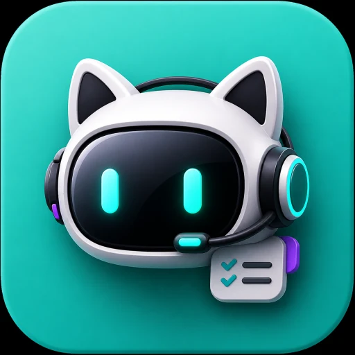

# workbuddy-best-practice

> 从一句话办公任务，到可复用的企业 Agent 工作流。  
> From workplace prompting to agentic office automation

**This is an unofficial community best-practice repository.**  
**本仓库非 WorkBuddy 官方项目，不代表腾讯云、CodeBuddy 或 WorkBuddy 官方立场。**

<p align="center">
  
</p>


本仓库以中文为主，面向 WorkBuddy 代表的 workplace agent / office agent / enterprise automation agent 场景，沉淀可复用的任务模板、workflow、checklist 与安全治理方法。它不是官方文档镜像，而是把官方能力转化为可执行、可验收、可复盘的办公 Agent 工程化实践。

## 项目适合谁

- 企业职能人员：行政、人事、财务、市场、运营、销售支持、项目管理等。
- AI Agent 实践者：希望把 prompt、workflow、Skill、Connector、Automation 变成可维护资产的人。
- 企业培训与知识库维护者：需要把办公 Agent 方法沉淀成课程、SOP、RAG 语料的人。
- 信息安全、IT 与数字化团队：需要评估权限、文件操作、第三方服务和自动化风险的人。

## 项目不是什么

- 不是 WorkBuddy 官方文档镜像，不搬运官方文档原文。
- 不是 WorkBuddy 官方支持渠道，不处理账号、计费、故障工单。
- 不是营销材料，不把 WorkBuddy 描述成万能工具。
- 不是 Claude Code 仓库模板，不把 `.claude/commands`、`.claude/agents`、`.claude/skills` 误写为 WorkBuddy 官方机制。
- 不是未经审计的 Skill / Connector 推荐榜，第三方能力默认需要风险评估。

## 为什么要做 WorkBuddy best practice

WorkBuddy 官方文档说明了产品功能：自然语言任务、自主规划执行、多模态办公处理、本地文件操作、结果查看、专家、技能、连接器、自动化、权限、记忆、模型与 Cloud Agent 等。最佳实践库要解决的是另一类问题：

1. 如何把“帮我做个报告”变成目标、输入、输出、边界、验收标准明确的任务。
2. 如何把一次成功的任务沉淀为可复用 workflow。
3. 如何在启用 Skill / Connector / Automation 前做安全评估。
4. 如何把 Claude Code 社区中成熟的工程化心智迁移到办公 Agent 场景，而不混淆产品机制。
5. 如何让企业内部培训材料、知识库和 RAG 系统复用这些经验。

## 核心方法论

先把办公任务变成可验收任务，再把可验收任务变成可复用流程，最后把可复用流程变成 Expert / Skill / Connector / Automation / Cloud Agent。

```text
Idea
  ↓
Task Brief
  ↓
Context Package
  ↓
Manual Run
  ↓
Result Review
  ↓
Workflow Template
  ↓
Expert / Skill / Connector
  ↓
Automation
  ↓
Cloud Agent
```


这套方法强调：prompt 不是一次性对话，而是可以版本化、审查、复盘和复用的工程资产。

## `.workbuddy/` 项目级上下文目录

本仓库包含一个 [`.workbuddy/`](.workbuddy/) 目录，用于存放面向 WorkBuddy 的项目级上下文，包括任务说明、写作规则、工作流、prompt 模板、审查清单和项目记忆。该目录是本仓库的实践约定，不代表 WorkBuddy 官方规范。

使用边界：

- `.workbuddy/` 是 project-level context folder for WorkBuddy-oriented workflows，不是官方必需目录。
- 不要声称 WorkBuddy 一定会自动读取 `.workbuddy/AI_AGENT_INSTRUCTIONS.md` 或 `.workbuddy/memory/PROJECT_MEMORY.md`。
- `.workbuddy/memory/PROJECT_MEMORY.md` 是人工维护的项目记忆，不等同于 WorkBuddy 官方 Memory 功能。
- 只提交稳定、可公开的项目级材料；不要提交临时记忆、运行日志、缓存、任务产物、私人上下文或敏感信息。

## 学习路径

1. **建立认知**：先读 [00-overview/README.md](00-overview/README.md)，理解 WorkBuddy 与 Chatbot、Claude Code 的差异。
2. **写好任务**：阅读 [01-getting-started/task-prompt-template.md](01-getting-started/task-prompt-template.md)，用 Task Brief 组织需求。
3. **准备上下文**：阅读 [01-getting-started/project-context-directory.md](01-getting-started/project-context-directory.md)，理解 `.workbuddy/` 如何作为本仓库的项目级 Context Package。
4. **验收结果**：阅读 [01-getting-started/result-review.md](01-getting-started/result-review.md)，学会检查产物、全部文件、变更和预览。
5. **控制风险**：阅读 [08-permission-security/permission-modes.md](08-permission-security/permission-modes.md)，理解默认权限、Full Access 与工作空间。
6. **沉淀模板**：复制 [templates/](templates/) 中的模板，用于任务、验收、Skill 评估、自动化设计和安全检查。

## 推荐阅读顺序

1. [WorkBuddy 是什么](00-overview/what-is-workbuddy.md)
2. [WorkBuddy vs Chatbot](00-overview/workbuddy-vs-chatbot.md)
3. [WorkBuddy vs Claude Code mental model](00-overview/workbuddy-vs-claude-code.md)
4. [办公 Agent 工程化心智模型](00-overview/mental-model.md)
5. [WorkBuddy 任务 Prompt 模板](01-getting-started/task-prompt-template.md)
6. [`.workbuddy` 项目级上下文目录指南](01-getting-started/project-context-directory.md)
7. [WorkBuddy 结果验收指南](01-getting-started/result-review.md)
8. [WorkBuddy Prompt Patterns](02-prompt-patterns/README.md)
9. [Workplace Agent Workflows](03-workflows/README.md)
10. [WorkBuddy 权限模式与企业安全规范](08-permission-security/permission-modes.md)

## 目录导航

- [00-overview/](00-overview/)：项目总览、心智模型、与 Chatbot / Claude Code 的关系。
- [01-getting-started/](01-getting-started/)：任务编写、项目级上下文目录、上下文准备、结果验收。
- [02-prompt-patterns/](02-prompt-patterns/)：Task Brief、文档生成、数据分析、文件处理和自动化前置 prompt patterns。
- [03-workflows/](03-workflows/)：从手动任务到可复用 workflow，再到 Expert / Skill / Connector / Automation 的升级路径。
- [04-experts/](04-experts/)：Expert / Expert Team 的定位、使用方式、团队协作和边界。
- [05-skills/](05-skills/)：Skill 的工具能力、安装启用、第三方风险和评估方法。
- [06-connectors/](06-connectors/)：Connector 的账号授权、数据流、撤销方式和治理模板。
- [07-automation/](07-automation/)：Automation 的触发、停止条件、人工确认和上线前检查。
- [08-permission-security/](08-permission-security/)：权限模式、工作空间、安全策略。
- [09-model-memory/](09-model-memory/)：模型配置、Memory 的使用方式和隐私边界。
- [10-cloud-agent/](10-cloud-agent/)：Cloud Agent 的 Runtime、Session、Manifest、凭据和评测。
- [11-case-studies/](11-case-studies/)：文件整理、会议纪要、报告/PPT、数据分析和资讯简报案例。
- [.workbuddy/](.workbuddy/)：本仓库实践约定的项目级 Context Package，不代表 WorkBuddy 官方规范。
- [assets/](assets/)：项目 Logo、README 插图和图片生成提示词记录。
- [templates/](templates/)：可复制的 Task Brief、Review、Skill 评估、Automation、安全清单。
- [sources.md](sources.md)：长期参考资料与来源使用规则。
- [changelog-watch.md](changelog-watch.md)：跟踪 WorkBuddy 更新对最佳实践的影响。
- [roadmap.md](roadmap.md)：仓库维护路线图。

## 贡献指南简版

- 新增或修改事实性内容前，优先检查 WorkBuddy 官方文档与 [Changelog](https://www.codebuddy.cn/docs/workbuddy/Changelog)。
- 官方事实、实践解释、风险提醒要尽量分开写。
- 第三方观点必须标注为“社区观察”或“第三方评价”。
- 不要复制官方文档大段原文；用自己的话总结并链接来源。
- 新增文章时补充 `Further Reading`，并更新相关导航。
- 涉及文件操作、权限、Skill、Connector、Automation、Cloud Agent 的内容，必须包含安全或权限说明。

## 免责声明

本仓库内容仅用于社区学习、企业内部培训和最佳实践沉淀。WorkBuddy 功能、界面、权限策略、模型能力和价格可能随版本变化，请以官方文档和产品界面为准。使用任何自动化、第三方 Skill / Connector 或完全访问权限前，请自行完成安全、合规和数据隐私评估。
